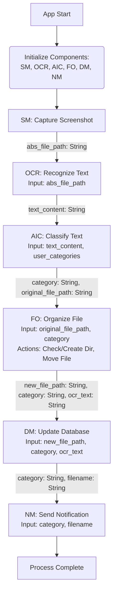

```mermaid
graph TD
    A[App Start] --> B(Initialize Components:<br/>SM, OCR, AIC, FO, DM, NM);

    B --> SM[SM: Capture Screenshot];
    SM -- abs_file_path: String --> OCR[OCR: Recognize Text<br/>Input: abs_file_path];
    OCR -- text_content: String --> AIC[AIC: Classify Text<br/>Input: text_content, user_categories];
    AIC -- category: String, original_file_path: String --> FO[FO: Organize File<br/>Input: original_file_path, category<br/>Actions: Check/Create Dir, Move File];
    FO -- new_file_path: String, category: String, ocr_text: String --> DM[DM: Update Database<br/>Input: new_file_path, category, ocr_text];
    DM -- category: String, filename: String --> NM[NM: Send Notification<br/>Input: category, filename];
    NM --> End[Process Complete];
```
